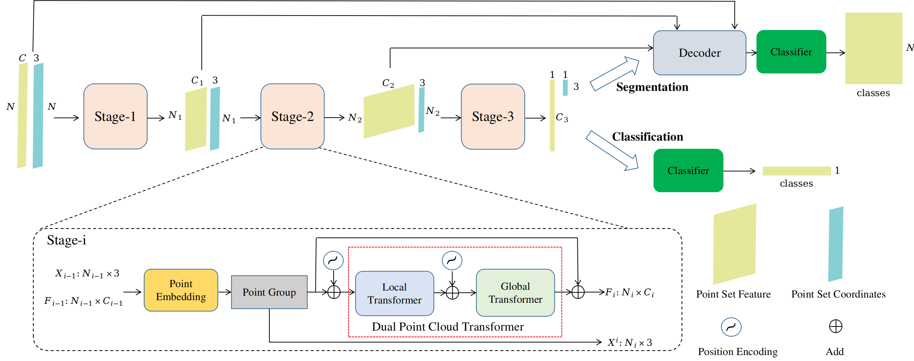

<!--
 * @Author       : ZHP
 * @Date         : 2022-02-15 13:58:30
 * @LastEditors  : ZHP
 * @LastEditTime : 2022-04-24 12:51:29
 * @FilePath     : /README.md
 * @Description  : 
 * Copyright 2022 ZHP, All Rights Reserved. 
 * 2022-02-15 13:58:30
-->
Progressive Point Cloud Transformer
> point cloud segmentation


### 环境准备
+ 1.安装pytorch1.4+

+ 2.安装依赖库 `pip install -r requirement.txt`

### 数据集
+ 1.Part Segmentation:使用`ShapeNet Part`数据集
+ 2.Scene Segmentation:使用`S3DIS`数据集
  


### 训练
```
cd PPCTNet
python train_partseg.py --model_name=PPLT_Model_Seg --nEpochs=300 --optimizer=SGD --learning_rate=0.06 --batch_size=32
```
